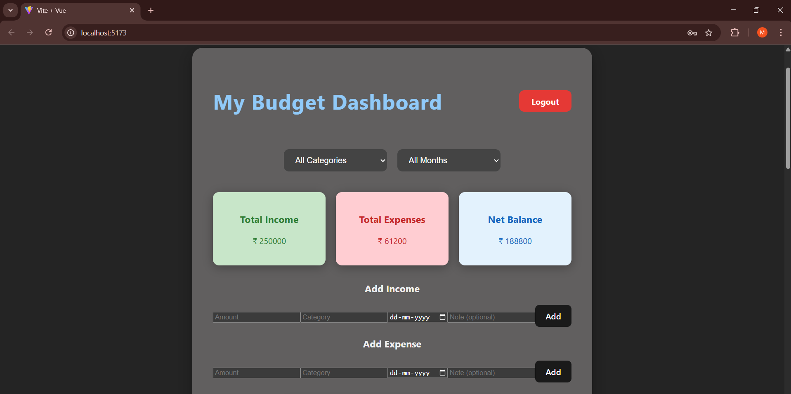
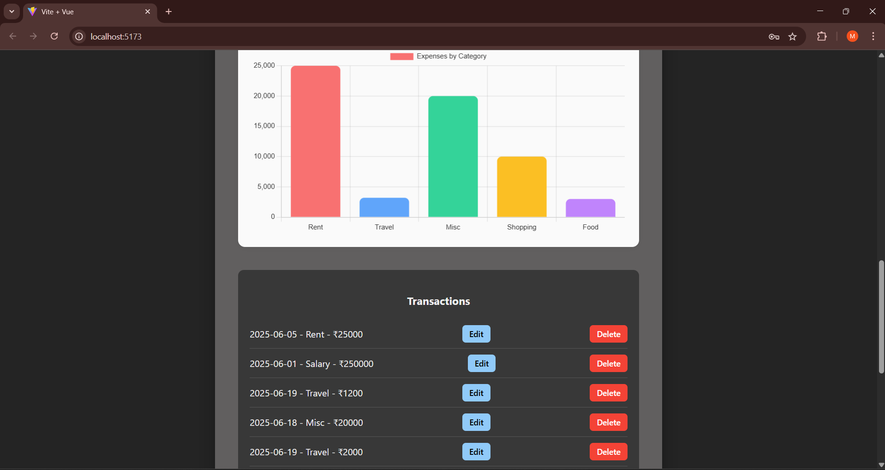
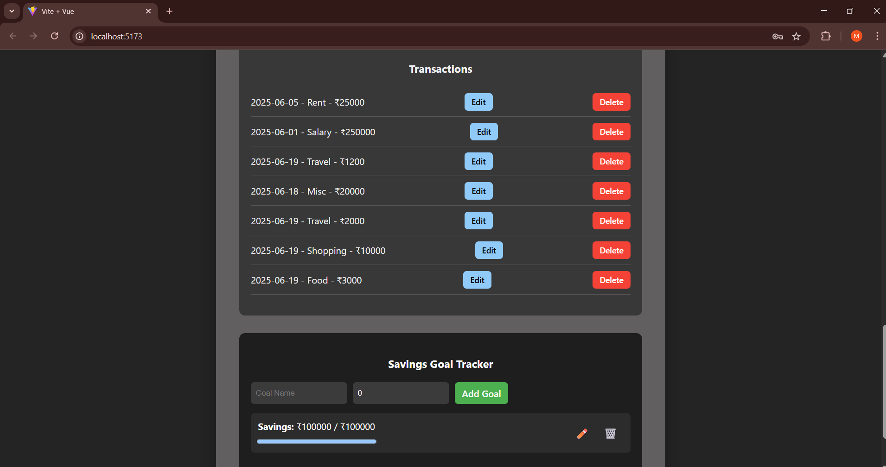

Budget Planner with Data Visualizations

An interactive budgeting dashboard built with Vue.js that allows users to manage their finances effectively by tracking income, expenses, and savings goals. Includes real-time data visualizations using Chart.js and secure user authentication with Firebase.

Tools & Technologies Used

- Vue.js - Frontend framework for building user interfaces
- Chart.js - Visualizes income vs expenses and category-wise spending
- Firebase (Authentication + Firestore) - User authentication and real-time data storage
- Tailwind CSS - Utility-first CSS framework for clean and responsive styling

How to Run Locally

1. Clone the Repository
   git clone https://github.com/mansinaidu07/BUDGET-PLANNER.git
   cd BUDGET-PLANNER

2. Install Dependencies
   npm install

3. Set Up Firebase
   - Go to Firebase Console: https://console.firebase.google.com/
   - Create a new project
   - Enable Email/Password Authentication
   - Create a Cloud Firestore database
   - Add your Firebase config to firebase.js

4. Run the App
   npm run dev

Features

- Secure user login/registration with Firebase Auth
- Add, view, and delete income and expense records
- Filter transactions by category and month
- Pie chart: Income vs Expenses summary
- Bar chart: Category-wise spending breakdown
- Add multiple savings goals with progress tracking
- Responsive design and dark-themed dashboard

Folder Structure

src/
├─ main.js
├─ App.vue
├─ components/
│  ├─ AuthForm.vue
│  ├─ Dashboard.vue
│  ├─ IncomeForm.vue
│  ├─ ExpenseForm.vue
│  ├─ GoalTracker.vue
│  ├─ ChartDisplay.vue
│  └─ BarChart.vue
├─ firebase.js

Conclusion

This project demonstrates a full-stack Vue.js application integrated with Firebase for user data persistence and authentication. The visual insights from charts make budget management engaging and intuitive. Ideal for beginners learning modern frontend frameworks with real backend integration.

#Screenshots
Login Page

Dashboard View

